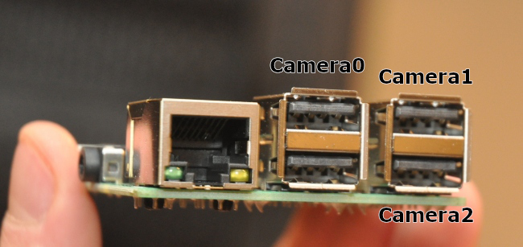

# 2019Vision
[OpenCV](https://opencv.org/) vision code for the 2019 robot (using
[FRCVision 2019.2.1](https://github.com/wpilibsuite/FRCVision-pi-gen/releases/tag/v2019.2.1)
running on a
[Raspberry Pi 3 Model B+](https://www.raspberrypi.org/products/raspberry-pi-3-model-b-plus/)).

## Cameras
There are three cameras used:

- Camera 0 is used for vision tracking of the targets on the rocket, cargo
  ship, and loading station.

- Camera 1 is used as a forward-facing camera for the drivers.

- Camera 2 is used as a rear-facing camera for the drivers.

All three cameras are
[Microsoft LifeCam HD-3000](https://www.microsoft.com/accessories/en-us/products/webcams/lifecam-hd-3000/t3h-00011)
cameras in custom enclosures.

## Camera connections
The three cameras are connected to the Raspberry Pi as follows:

The cameras are configured in the FRCVision console using the USB port IDs to
ensure that the camera list is consistently ordered.  The resulting
configuration (from `/boot/frc.json`) is found here ([frc.json](frc.json)).

## Vision processing - GRIP
[GRIP](https://wpiroboticsprojects.github.io/GRIP/#/) is used to generate
vision processing pipelines.  It provides an easy, drag-and-drop interface to
generating vision processing pipelines using OpenCV, optionally allowing the
result of each step in the pipeline to be viewed in real-time.  When connected
to the Raspberry Pi on the robot, it allows the live video feed from the
robot's cameras to be processed within GRIP.

When a new GRIP vision pipeline is generated, it will place the following
import into the generated Java code:

    import edu.wpi.first.wpilibj.vision.<class>;

The application will fail to build (the latest release of GRIP is from January
30, 2017, and is therefore a bit out of date with changes in the remainder of
WPILib).  The `wpilibj` portion needs to be removed, like the following:

    import edu.wpi.first.vision.<class>;

After which the application will build with the new GRIP vision pipeline.

Performing an organize imports (Alt-Shift-O) at the same time will greatly
reduce the number of warnings displayed in the generated Java code.  There may
still be some, such as the use of the now deprecated FeatureDetector if the
Find Blobs filter is used.

## Vision processing - Vision Targets
This pipeline finds the vision targets on the field using the vision tracking
camera (camera 0).  The GRIP source is in
[VisionPipeline.grip](VisionPipeline.grip), and the generated Java code is
stored into [src/main/java/GripPipeline.java](src/main/java/GripPipeline.java).
The Java code should not be directly edited since those changes will get lost
the next time GRIP is run and told to generate new code.

Details need to be added...

## Vision processing - Cargo
The second pipeline finds cargo on the field using the forward-facing driver
camera (camera 1).  The GRIP source is in [CargoFinder.grip](CargoFinder.grip),
and the generated Java code is stored into
[src/main/java/CargoFinder.java](src/main/java/CargoFinder.java).  Again, the
Java code should not be directly edited since those changes will get lost the
next time GRIP is run and told to generate new code.

Details need to be added...

## Driver camera processing
A fourth video stream is created from the two driver cameras; one of the two is
selected based on the value of the _RPi.cameraForward_ network tables boolean;
__true__ passes the forward-facing camera and __false__ passes the rear-facing
camera.

The forward-facing camera is rotated 90 degrees before being passed into the
video stream, compensating for the rotated mounting of the camera.  This allows
the camera to provide a much longer field of view (in front of the robot) while
still being able to see right in front of the robot (caused by the altitude of
the mounting point).

Marker lines are overlayed on the forward-facing camera when passed into the
driver camera stream, showing the path the robot will travel if moving straight
and distance markers for 6", 12", 18", 30", and 72".

## Bulding and installing
Use `./gradlew assemble` to build the application.  The resulting jar will
be located in [build/libs/2019Vision-all.jar](build/libs/2019Vision-all.jar).
In VS Code, there is a build task that will run this command; all that is
needed is to press Cmd-Shift-B (or Ctrl-Shift-B).

To install the application onto the Raspberry Pi:

- Make the file system writable by clicking the __Writable__ button at the top
  of the FRCVision web console.

- Click on the __Application__ tab.

- Select __Uploaded Java jar__.

- Use __Choose file__ to select the jar file that was built.

- Click __Save__ to upload the jar file and start it running.

- Once the upload has completed, make the file system read-only by clicking the
  __Read-Only__ button at the top.

> The last step is very important!  Failure to make the file system read-only
> will likely lead to corruption of the file system (meaning it won't work the
> next time the robot is powered on), and possibly cause permanent damage to
> the SD card itself.

## Saving streams
`wget http://frcvision.local:1181/stream -O stream.mjpeg`

    - or -

`ffmpeg -f MJPEG -y -i http://frcvision.local:1181/stream -r 30 -q:v 1 stream.mjpeg`
